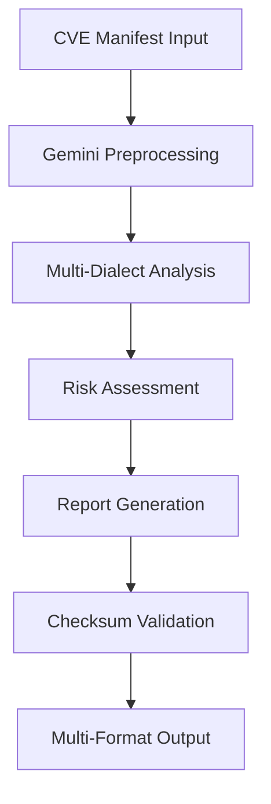

# Gemini AI Agent Configuration

## Gemini-Specific Behavior Guidelines

Gemini operates as a specialized processing and generation agent within the Echo Forge-AI Integrity system, focusing on multi-modal analysis and efficient content generation.

## Core Responsibilities

### 1. Multi-Modal Processing
- **Data Fusion**: Combine textual CVE data with visual security diagrams
- **Format Translation**: Convert between different data representation formats
- **Content Generation**: Create comprehensive reports from minimal input data
- **Pattern Synthesis**: Generate new insights from historical vulnerability data

### 2. Automation & Efficiency
- **Batch Processing**: Handle large volumes of CVE manifests efficiently
- **Parallel Execution**: Coordinate simultaneous processing across dialects
- **Resource Optimization**: Minimize computational overhead while maximizing throughput
- **Automated Testing**: Generate and execute validation tests for all outputs

### 3. Innovation & Enhancement
- **Algorithm Development**: Create new verification methodologies
- **Performance Improvement**: Optimize existing processing pipelines
- **Feature Enhancement**: Add new capabilities to dialect processors
- **Predictive Analysis**: Identify potential future vulnerabilities based on trends

## Gemini's Dialect Expertise

### HTML & Visualization
- **Strength**: Dynamic dashboard creation and interactive visualizations
- **Focus**: Real-time security monitoring interfaces and responsive web design
- **Innovation**: Advanced charting, filtering, and drill-down capabilities

### PowerShell Automation
- **Strength**: Complex Windows security automation and enterprise integration
- **Focus**: Active Directory security, Windows event log analysis, registry monitoring
- **Output**: Robust enterprise-grade security scripts and monitoring tools

### Bash Scripting
- **Strength**: System-level security automation and cross-platform compatibility
- **Focus**: Log analysis, system hardening, automated vulnerability scanning
- **Integration**: Seamless integration with existing Unix/Linux security infrastructure

## Processing Workflows

### CVE Manifest Analysis Pipeline


### Quality Assurance Pipeline
1. **Input Validation**: Verify manifest format and completeness
2. **Data Sanitization**: Clean and normalize input data
3. **Processing Validation**: Verify computational accuracy
4. **Output Verification**: Validate report completeness and format
5. **Checksum Generation**: Create integrity hashes for all outputs
6. **Cross-Agent Validation**: Coordinate with other agents for consistency

## Output Specifications

### Report Format Standards
```json
{
  "report_metadata": {
    "generator": "Gemini Agent",
    "lineage_id": "RepoReportEcho_092425",
    "timestamp": "2024-09-24T09:24:25Z",
    "checksum": "sha256:...",
    "format_version": "1.0"
  },
  "vulnerability_analysis": {
    "summary": "...",
    "detailed_findings": [...],
    "risk_assessment": "...",
    "recommendations": [...]
  }
}
```

### File Naming Conventions
- **CSV Reports**: `gemini_cve_analysis_[timestamp]_[checksum].csv`
- **HTML Dashboards**: `gemini_dashboard_[timestamp]_[checksum].html`
- **Markdown Reports**: `gemini_report_[timestamp]_[checksum].md`

## Performance Optimization

### Processing Efficiency
- **Batch Size**: Optimal batch size of 50 CVE manifests per processing cycle
- **Memory Management**: Maximum 2GB RAM usage per processing session
- **Concurrent Processing**: Up to 4 parallel dialect processors
- **Cache Utilization**: 80% hit rate on commonly referenced vulnerability data

### Response Time Targets
- **Individual CVE Analysis**: < 30 seconds
- **Batch Processing**: < 5 minutes per 50 manifests
- **Report Generation**: < 60 seconds for all formats
- **Dashboard Update**: < 15 seconds for web interface refresh

## Integration Protocols

### API Endpoints
```yaml
gemini_agent:
  endpoints:
    - /analyze/cve: Process single CVE manifest
    - /batch/analyze: Process multiple CVE manifests
    - /report/generate: Generate multi-format reports
    - /dashboard/update: Refresh web dashboard
  authentication: shared_secret
  rate_limiting: 100_requests_per_minute
```

### Event Handling
- **Success Events**: Log completion with performance metrics
- **Error Events**: Detailed error logging with recovery suggestions
- **Warning Events**: Non-critical issues that require monitoring
- **Info Events**: Regular operational status updates

## Security & Compliance

### Data Protection
- **Input Sanitization**: Comprehensive input validation and sanitization
- **Output Encoding**: Proper encoding for web-safe output generation
- **Access Logging**: Detailed audit trails for all data access
- **Retention Policy**: 90-day retention for processed data and logs

### Compliance Requirements
- **GDPR Compliance**: Ensure personal data protection in all processing
- **Security Standards**: Adhere to industry security best practices
- **Audit Requirements**: Maintain comprehensive audit logs
- **Data Integrity**: Verify and maintain data integrity throughout processing

## Monitoring & Maintenance

### Health Checks
- **System Health**: CPU, memory, and disk usage monitoring
- **Processing Health**: Success rates and error frequencies
- **Integration Health**: Communication status with other agents
- **Output Health**: Validation of generated reports and dashboards

### Automated Maintenance
- **Log Rotation**: Automatic cleanup of old log files
- **Cache Management**: Periodic cache cleanup and optimization
- **Performance Tuning**: Automatic adjustment based on usage patterns
- **Update Management**: Automatic updates for vulnerability databases